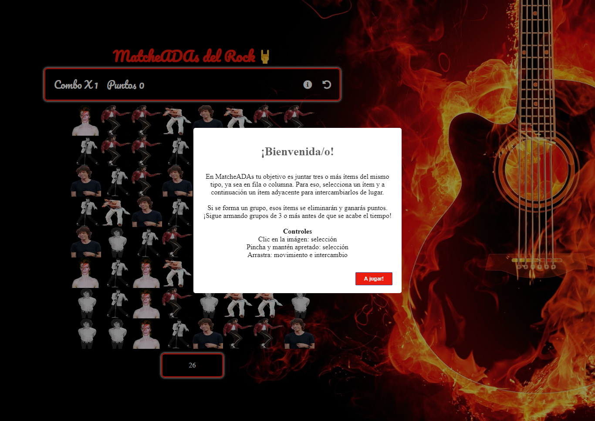

# MatcheAdas Rock 🎸

Este es un proyecto realizado con ADA ITW en los comienzos del aprendizaje de JavaScript. Será un trabajo que se mejorará con el tiempo a medida que incorpore más conocimientos del lenguaje , ya que abarca muchísimo más de lo que uno se imagina.
MatcheAdas Rock es un juego dónde tienes que encontrar tres rockstars adyacentes en la grilla para poder realizar el matcheado y así sumar puntos, todo en el tiempo de 30 segundos.

## Para ver cómo queda el proyecto, a medida que se va mejorando y actualizando, puedes dar clic al siguiente [enlace](https://karijofre.github.io/Matcheadas-rock/) o puedes hacerlo desde [aquí](https://confident-wilson-9645ea.netlify.app/)
<br>

***
## Para obtener el código en tu ordenador, sigue los siguientes pasos en tu terminal.
***

- Ir al [repositorio](https://karijofre.github.io/Matcheadas-rock/)
- Darle clic al botón de CODE.
- Copia la url
- Abre tu terminal y pon el comando de ``` git clone <url> ```
- Entra en la carpeta del proyecto y ábrelo en tu IDE

## Este proyecto no necesita la instalación de ninguna dependencia al inicio del mismo, quizá en el trayecto de la mejora , lo hará 😉

***
<br>

## Este debería ser el resultado final del proyecto instalado



***

Este trabajo es el esfuerzo que conlleva para mí poder emplear la lógica en JS como desafío personal e intelectual, porque confieso que aún me falta muchísimo por comprender y éste es el trabajo en el cuál se demostrará la evolución del aprendizaje. "El mundo IT no me deja de sorprender."

### Nunca codees sin música, y si es rock mucho mejor  Kari Jo 🤘

